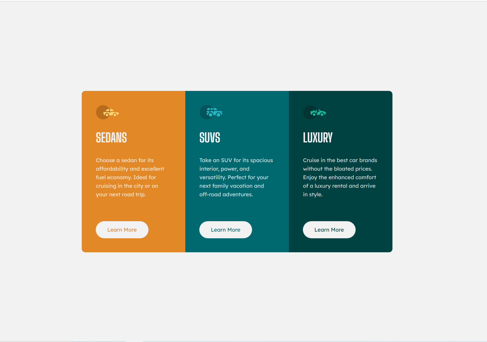

# Frontend Mentor - 3-column preview card component

This is a solution to the [3-column preview card component challenge on Frontend Mentor](https://www.frontendmentor.io/challenges/3column-preview-card-component-pH92eAR2-).

## Screenshot

## Links

- Solution URL -  [GitHub repository](https://github.com/dostonnabotov/3-column-preview-card-component-main)
- Live Site URL - [Live Site](https://dostonnabotov.github.io/3-column-preview-card-component-main/)

## Author

- Website - [Doston Nabotov](https://www.dostonnabotov.netlify.app)
- Frontend Mentor - [@dostonnabotov](https://www.frontendmentor.io/profile/dostonnabotov)
- Github - [@dostonnabotov](https://www.github.com/dostonnabotov)